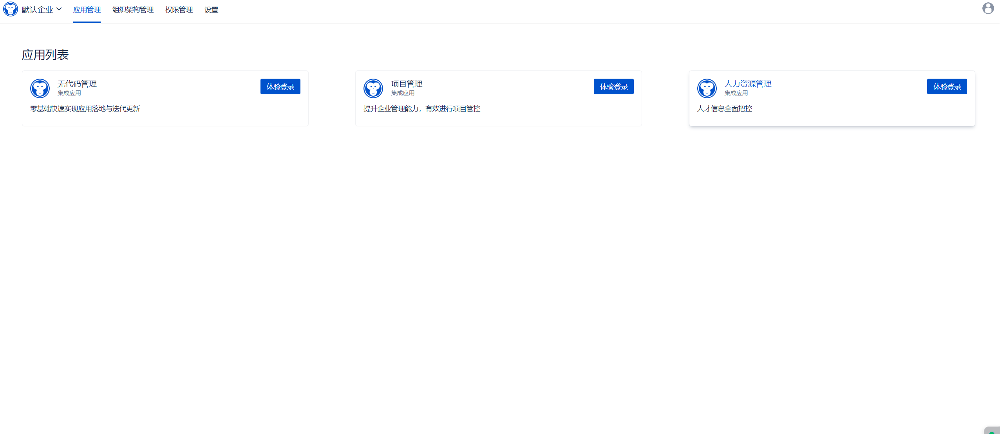
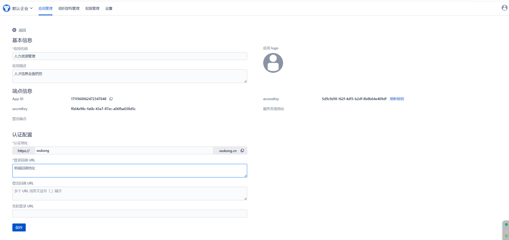
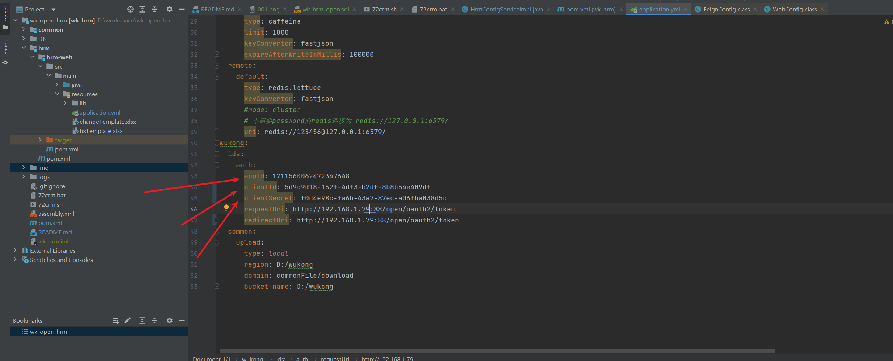
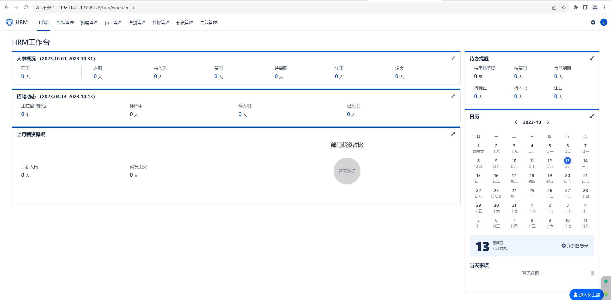
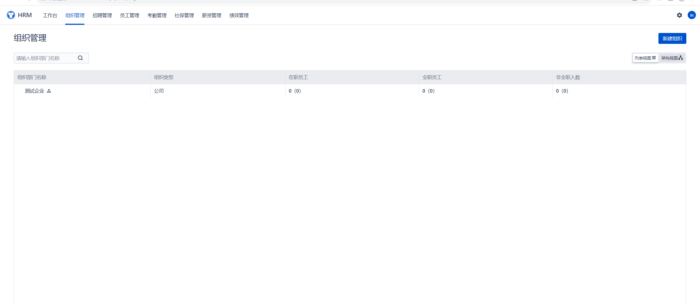
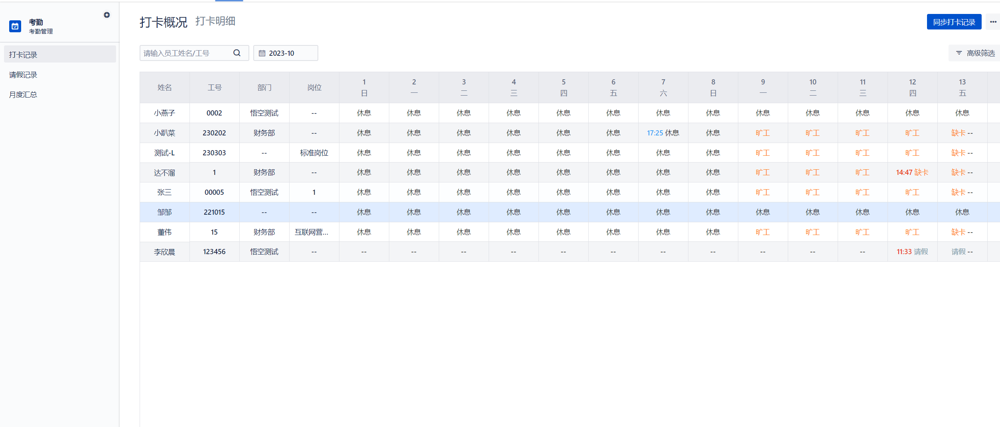
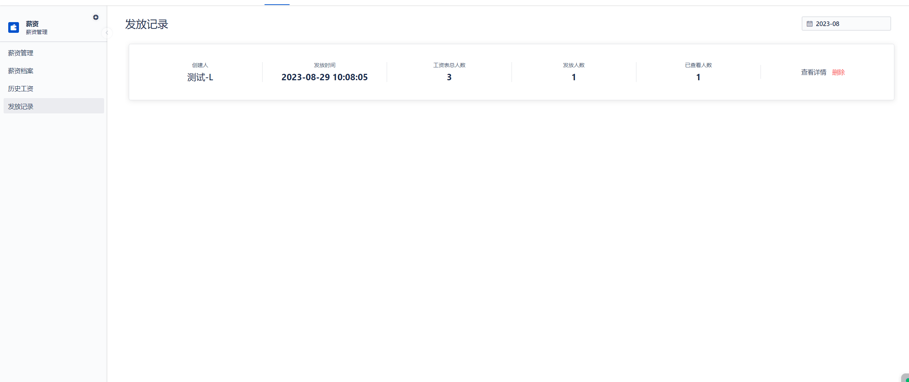
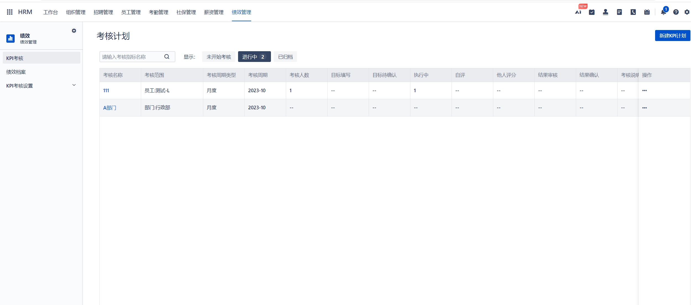

# wk_open_hrm

Experience address: [https://www.72crm.com](http://www.72crm.com)

## Introduction to Wukong Human Resource Management

Wukong Human Resource Management System is officially open source. Starting from the perspective of human resource management, it centrally manages almost all information related to human resources (organizational planning, recruitment management, employee management, attendance management, social security management, performance management) with centralized data.

Official website address: [http://www.5kcrm.com](http://www.5kcrm.com/)

Scan the QR code to add Wukong's official customer service WeChat, and invite you to join the thousand-people WeChat exchange group:


Follow the Wukong CRM official account to learn more about Wukong information


Scan the QR code to join the WeChat group, online customer service will answer your questions


:boom:  :boom:  :boom: Note: Wukong Human Resource Management System adopts a new front-end and back-end separation mode, and the code in this repository has integrated the front-end vue packaged files, ** which can save the packaging operation, no need to run the front-end **

# Directory Structure of Wukong Project Management

```lua
wk_open_hrm
├── common        -- Basic module
├── DB            -- SQL files
├── hrm           -- Human Resource Management Module
├── ux            -- Front-end source code
```

# Core Functional Modules

**Employee Organization Management, Optimal Configuration of Talent Resources** <br/>
**Attendance Management, Increase Employee Mobility** <br/>
**Salary Management, Empower Enterprise Talent Strategy** <br/>
**Social Security Management, Provide Sufficient Protection for Employees** <br/>
**Performance Management, Mobilize the Enthusiasm of All Staff** <br/>
**Employee Self-service, All Related Information of Employees at a Glance** <br/>

# Main Technology Stack Used by Wukong Human Resource Management

# Backend:

|Name                   | Version     | Description|
|-----------------------|-------------|------------|
| spring-cloud-alibaba  | 2021.0.5.0  | Core Framework|
| spring-boot           | 2.7.15      | Spring Version|
| mybatis-plus          | 3.5.3.2     | ORM Framework|

# Frontend:

| Technology | Description | Version |
|------------|-------------|---------|
| [Vue](https://vuejs.org) | Framework | 2.5.17 |
| [Vue-router](https://router.vuejs.org) | Routing Framework | 3.0.1 |
| [Vuex](https://vuex.vuejs.org) | Global State Management Framework | 3.0.1 |
| [Element](https://element.eleme.io) | UI Framework | 2.12.0 |
| [Axios](https://github.com/axios/axios) | HTTP Framework | 0.18.0 |

# Instructions for Use

### I. Installation of this project needs to be carried out in a Linux environment, and Linux environment can be installed in a virtual machine

The configuration requirements for the Linux environment are as follows:

Recommended operating system: centos
System memory: ≥16G
System CPU: ≥4 cores
Disk size: ≥100G

### II. Prerequisite Environment, the following configurations need to be installed in the Linux environment

- Jdk1.8
- Maven 3.5^
- Mysql 8^
- Redis (version unlimited)
- elasticsearch 8.5.3

### Installation Instructions

#### I. Installation of Dependent Environment

###### 1. Install jdk

```
yum -y install java-1.8.0-openjdk-devel;
```

###### 2. Install redis

```
yum -y install epel-release;
yum -y install redis;
systemctl start redis

#-- Modify the redis password to 123456
yum -y install vim;
vim /etc/redis.conf;

#-- Append a line at the bottom of the file
requirepass 123456
#-- Or enter / to search for # requirepass foobared
#-- Remove the # in front, and change foobared to 123456
#-- After modifying, type :wq to save and exit, restart redis

systemctl restart redis
```

###### 3. Install mysql

```
wget https://repo.mysql.com//mysql80-community-release-el7-3.noarch.rpm
yum -y install mysql80-community-release-el7-3.noarch.rpm
yum -y install mysql-community-server --nogpgcheck
sudo systemctl start mysqld.service;
sudo systemctl enable mysqld.service;

--View the default password of the installed mysql
grep "password" /var/log/mysqld.log
--Enter mysql, for example: mysql -u root -p"GXOO%eiI/7o>"
mysql - u root -p"Enter the default password from the previous step here" 
 
--Modify the mysql password as shown below
set global validate_password_policy=LOW;
ALTER USER 'root'@'localhost' IDENTIFIED BY 'password';

--Exit mysql
exit
    
--Modify mysql configuration
vim /etc/my.cnf;
--Enter i to enter edit mode, modify the sql_mode setting, copy the following sql_mode configuration, paste it using shift+insert under [mysqld]
sql_mode=STRICT_TRANS_TABLES,NO_ZERO_IN_DATE,NO_ZERO_DATE,ERROR_FOR_DIVISION_BY_ZERO,NO_ENGINE_SUBSTITUTION 
--After modification, press the esc key, then :wq to save and exit, restart mysql

service mysqld restart;
```

### 4. Install Elasticsearch (ES)

```
-- Download ES

# Note: Do not place it in the root directory.

useradd elasticsearch
wget https://artifacts.elastic.co/downloads/elasticsearch/elasticsearch-8.5.3-linux-x86_64.tar.gz
tar xvf elasticsearch-8.5.3-linux-x86_64.tar.gz
chown -R elasticsearch:elasticsearch elasticsearch-8.5.3
chmod -R 777 elasticsearch-8.5.3

-- Modify ES configuration file: elasticsearch.yml

# If the following configuration information is present in the ES installation, you need to modify the configuration.

ingest.geoip.downloader.enabled: false  ## Add this configuration
xpack.security.enabled: true
xpack.security.enrollment.enabled: true

xpack.security.http.ssl:
  enabled: false        # Change to false
  keystore.path: certs/http.p12

Enable encryption and mutual authentication between cluster nodes
xpack.security.transport.ssl:
  enabled: false         # Change to false
  verification_mode: certificate
  keystore.path: certs/transport.p12
  truststore.path: certs/transport.p12

-- Install ES tokenizer
./elasticsearch-plugin install analysis-icu
-- Reset ES account password
./elasticsearch-reset-password -u elastic

-- Enter the bin directory and start ES
su elasticsearch
./elasticsearch
```

#### II. Project Configuration and Startup

yum -y install maven

###### 1. Import the database under the DB directory

```
create database wk_hrm_open character set utf8mb4 collate utf8mb4_general_ci;
use wk_hrm_open;
source XXX (project path)
```

###### 2. Execute mvn install in the project root directory

###### 3. Modify the following configuration information in the project:

###### 3. Configure database account and password information as well as Redis account information in the hrm module under the resource directory`

###### 4. Visit [Wukong ID](https://id.72crm.com/) to obtain an account

###### After registering, click on the default enterprise, and select Human Resource Management from the application list



###### Click on Human Resource Management



##### Copy App ID, accessKey, and secretKey to hrm-web\src\main\resources\application.yml, corresponding to appId, clientId, and clientSecret as shown in the image below


Copy appId to hrm-web\src\main\resources\static\APPLICATION_ID.txt, replacing its contents

###### 5. Project Packaging and Deployment

```
-- Project packaging
mkdir /opt/package
mvn clean -Dmaven.test.skip=true package
cp hrm-web/target/hrm-web.zip /opt/package
cd /opt/package
unzip hrm-web.zip -d hrm
cd hrm-web
sh 72crm.sh start
```

###### 6. Running and Packaging the Frontend Project

```
- Download and install Node.js (LTS): https://nodejs.org/;
- This project is a front-end and back-end separation project. Local access requires setting up the back-end environment. Please refer to [Backend Project](https://gitee.com/wukongcrm/crm_pro);
- Accessing the online interface does not require setting up the back-end environment. You only need to change the target in the proxyTable under dev in the config/index.js file to the online address;
- Execute npm install to download related dependencies;
- Execute npm run dev to run the project;
- Upon successful execution, you can visit http://localhost:8090 to view the project.

Packaging:
- You need to adjust BASE_API in the config/prod.env.js file according to your needs
- Execute npm run build
- Packaging is complete
```

### III. Additional Notes

#### 1. API Documentation<br/>

```
API documentation address: http://localhost:44311/doc.html
```

#### 2. Docker Images<br/>

```
Stay tuned
```

### IV. Preview of Wukong Human Resources Functional Modules









